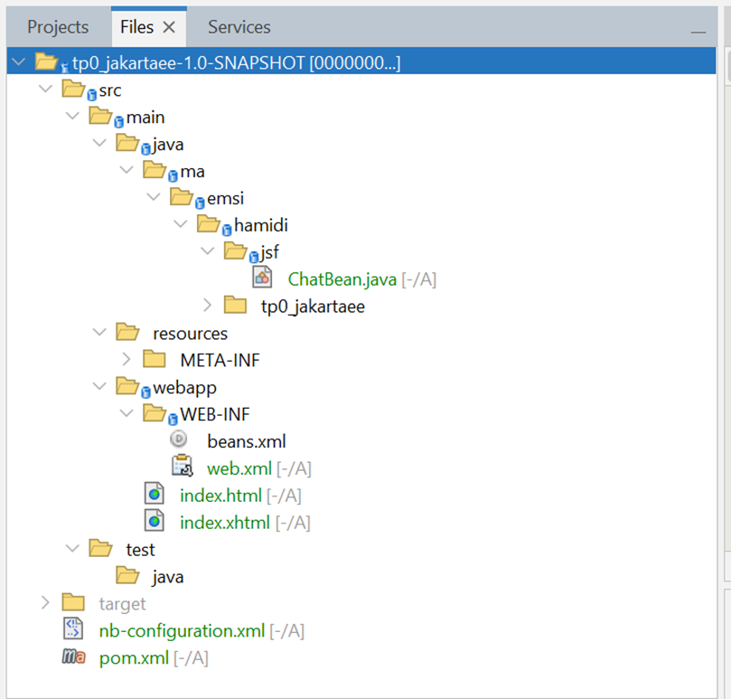
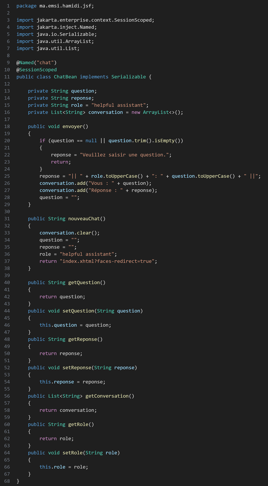
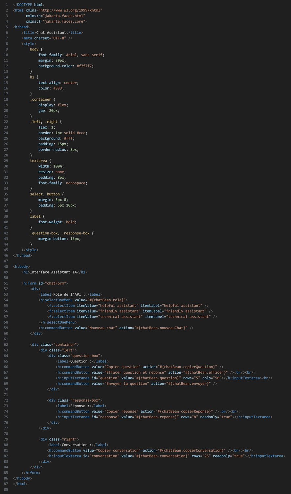
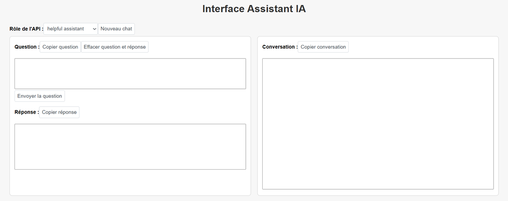

# **Compte Rendu du TP0 Jakarta EE**

---

## **1. Objectif du TP**

L'objectif de ce TP était de créer une première application web dynamique en utilisant **Jakarta EE** (anciennement Java EE) et le serveur **Payara Server**, afin de se familiariser avec :

- la structure d'un projet Jakarta EE,
- les technologies **JSF (Jakarta Faces)** et **Facelets (XHTML)**,
- le déploiement d'une application web sur un serveur d'application.

L'application développée est une **interface de type "assistant IA"**, simulant un mini-chat entre l'utilisateur et un assistant intelligent.

---

## **2. Outils utilisés**

- **IDE :** Apache NetBeans  
- **Serveur d'application :** Payara Server 6.2025.10  
- **Langage :** Java (Jakarta EE 10)  
- **Vue :** JSF (Java Server Faces) - XHTML  
- **Moteur de build :** Apache Maven  

---

## **3. Création du projet**

- Ouvrir **NetBeans**  
- Aller dans **File → New Project → Jakarta EE → Web Application**  
- Donner un nom au projet : `tp0_jakartaee`  
- Choisir le serveur : **Payara Server 6.2025.10**  
- Choisir la version de la plateforme : **Jakarta EE 10 Web**  
- Terminer pour générer la structure suivante :

---

## **4. Réalisation du code**

### **a) Le Managed Bean : ChatBean.java**

Ce bean gère la logique métier (les interactions entre les zones de texte et les boutons).

### **b) L'interface utilisateur : index.xhtml**

Le fichier **index.xhtml** représente **l'interface utilisateur principale** de mon application Jakarta EE.  
Il s'agit d'une **page Facelets** qui permet de lier des éléments visuels (boutons, zones de texte, menus, etc.) à la logique Java du **Managed Bean ChatBean**.

En d'autres termes, index.xhtml joue le rôle de **vue** dans le modèle MVC (Model-View-Controller) :

- la **vue (index.xhtml)** : gère l'affichage et les interactions utilisateur,  
- le **contrôleur (ChatBean.java)** : exécute les actions et manipule les données,  
- le **modèle** : correspond ici aux variables (`question`, `reponse`, `conversation`, `role`) manipulées par JSF.

L'objectif de cette page est de proposer une interface web simple et claire simulant une **conversation entre un utilisateur et un assistant IA**.

---

## **5. Exécution et résultats**

### **Étapes :**
- Lancer **Payara Server** depuis NetBeans  
- Faire **Run Project**  
- Ouvrir l'URL : <http://localhost:8080/tp0_jakartaee/>  

### **Résultat :**
Une page s'affiche avec :

- un sélecteur de rôle ("helpful assistant", "friendly assistant", etc.)
- une zone "Question" pour saisir le texte
- un bouton "Envoyer la question"
- une zone "Réponse" affichant la réponse générée
- un historique de la "Conversation"

